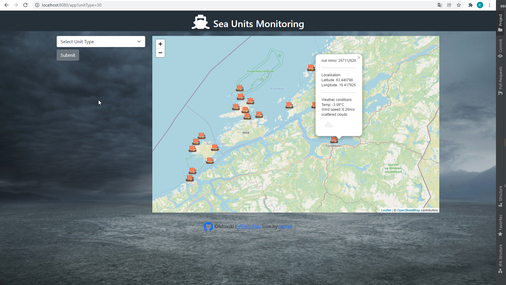
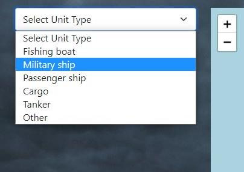
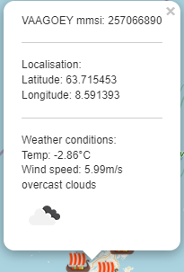
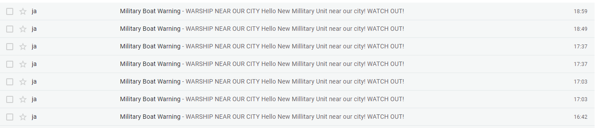
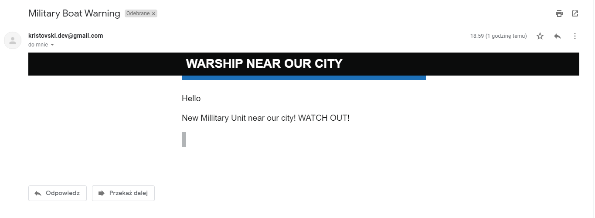

# Sea Units Monitoring

[](https://circleci.com/gh/KrisTovski/sea-units-monitoring/tree/master)


## Informacje ogólne
Aplikacja ta powstała z jednej strony w celach edukacyjnych,
a z drugiej (a może przed wszytkim) na potrzeby **konkursu** zorganizowanego przez **Przemysława Bykowskiego**:
https://bykowski.pl/wez-udzial-w-konkursie-programistycznym-monitorowanie-jednostek-morskich/

Zadaniem uczesników konkursu było **stworzenie aplikacji do śledzenia jednostek morskich w czasie rzeczywistym**.

_"Wykorzystując dane pobierane z AIS utwórz aplikację, która będzie wyświetlała informacje na temat jednostek morskich na mapie."_

Korzystając z podwalin aplikacji, którą Przemek stworzył w czasie swojego live'a na kanale Youtube
(https://www.youtube.com/channel/UCjWnQvpQgSRLeDEYQC0ZuLg) rozbudowałem aplikację o następujące funkcjonalności:

1. **Wyświetlanie na mapie jednostek morskich konkretnego typu.**
   - Domyślnie przy odpytaniu endpointu "/app" wyświetlamy pustą mapę (pierwotnie wyświetlały się wszystkie jednostki każdego typu
   ale pobieranie z API trwało wieczność, więc w celach deweloperskich kod za to odpowiadający został zakomentowany)
   - Wybieramy z listy rozwijanej rodzaj statku, które chcemy zobaczyć. Do wyboru są jednostki rybackie, wojskowe,
   pasażerskie, towarowe, tankowce i inne.
2. **Automatyczne pobieranie nowego tokenu do Barentswatch API.**
    - Pobrany token jest ważny tylko przez godzinę. Przy pisaniu kodu i testowaniu aplikacji uciążliwe było generowanie nowego kodu ręcznie,
   więc funkcjonalność powstała głównie z potrzeby chwili ;) 
3. **API pogodowe - OPENWEATHER** (https://openweathermap.org/)
    - Dodałem api pogodowe w celu pobrania i wyświetlenia dla każdego statku aktualnej pogody
    temperatury, predkości wiatru oraz ikony pogodowej.
4. **Alert wojenny!**
    - Gdy w pobliżu danego punktu (konkretnie w odległości do 100km od miasta Trondheim)
    pojawi się statek wojenny (kod 35) wysyłany jest alert na MAILA, a dane jednostki zapisywamne są do bazy danych.
5. **Warstwa UI**
   - Nadałem wygląd aplikacji aby była przyjemniejsza dla oka
   - Zamieniłem standardowe znaczniki na łodzie wikingów ;)
6. Wyświelanie linii do punktu docelowego.
   - funkcjonalność dodana przez Przemysława Bykowskiego
   - uwaga, ze wzlgędu na wykorzystany miesięczny limit połączenia do positionstack aktualnie dane nie sa pobierany i każdy statek wskazuje pozycje 0,0.

## Technologie
* Java 11
* Spring Boot
* Maven
* Hibernate & Spring Data JPA
* Java Mail Sender
* MySQL
* H2
* Jasypt (szyfrowanie haseł)
* Liquibase
* Docker
* Thymeleaf
* HTML
* CSS
* JS
* Lombok
* CircleCi CI/CD
* Heroku
* Cleardb

## Demo aplikacji
https://sea-units-monitoring.herokuapp.com/app

Aplikacja została umieszczona na heroku. Niestety ze względu na to, że jest to darmowy plan,
połączenie często trwa dosyć długo. Występuje też problem z maksymalną ilością połączeń do bazy danych :(

## Docker Image
Aplikację można także pobrać z mojego DockerHuba.
W ten sposób uruchomimy wersj, kóra działa na bazie H2, więc nie łączy się z bazą produkcyjną
ClearDb na Heroku.
Przetestowałem lolaknie ale w razie problemów z uruchomieniem proszę o kontakt. 

```
docker pull -a kristovski/sea-units-monitoring
```
```
docker run -d -p 8080:8080 -e "SPRING_PROFILES_ACTIVE=dev" kristovski/sea-units-monitoring:latest
```

## Screenshots

Wygląd główny:


Wybieranie typu jednostki:


Wyświetlanie informacji o statku, położeniu, warunkach pogodowych:


Przychodzące maile:


Mail z ostrzeżeniem: 
